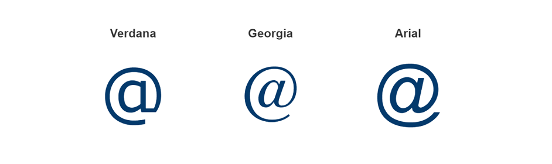
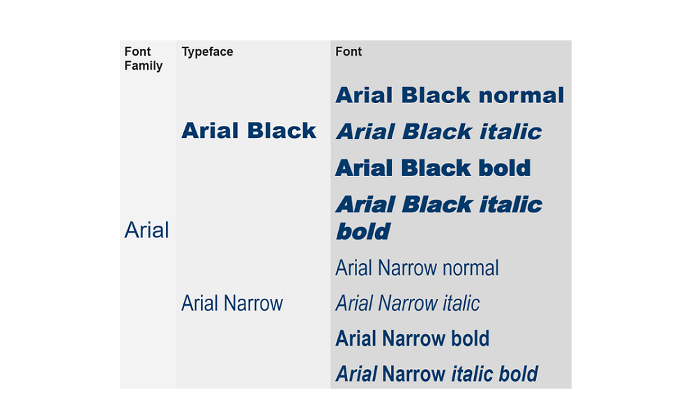
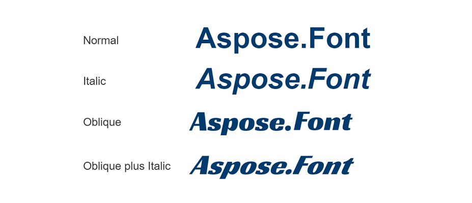
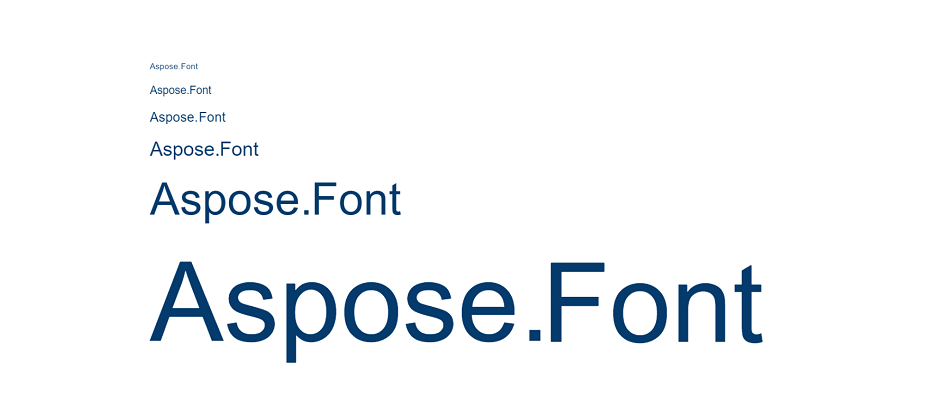
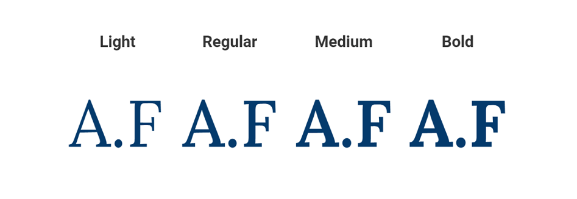
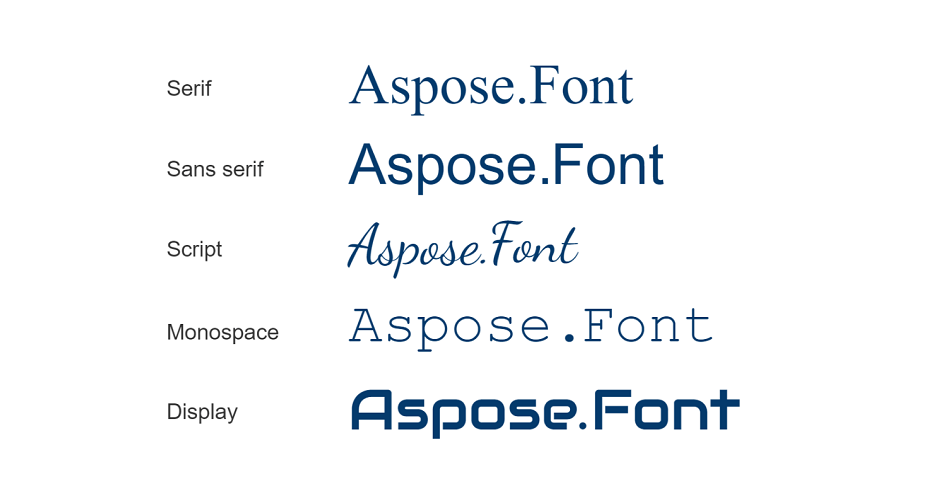
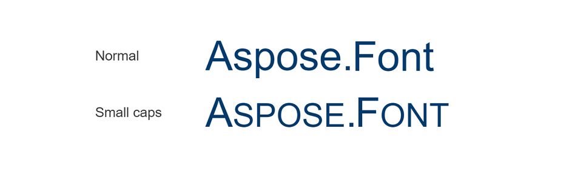
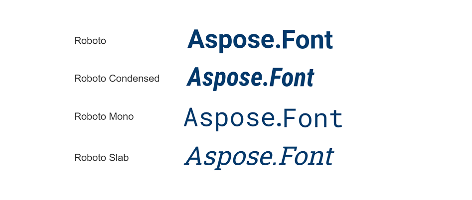

## Glossary ##

Let's notify the terms used in this article.

And the first and the main question is, what is font?

**Font** is the set of graphical representations of symbols. The way a font looks depends on the font's parameters such as type family, typeface, font proportions, etc.

**Glyph** - is a graphical representation of a symbol. It is aimed to depict a distinguished character.
The glyph is a unique shape, design, or way it looks. It is how the character is rendered in a particular font.

In the image below, you see the glyph `@` rendered in different fonts.

**Typeface** - is a specific design of a font. It has size, weight, width, slope, and other variations. It is often confused with the term **font**. The point is that fonts have particular (fixed) parameters. So the difference is in having variations. Therefore every variation in a typeface is an individual font. 
The term **typeface** is also often mixed up with the type/font family. 

So, what is font family?
**Font family** is a group of related, similar in design typefaces. The members of a family have a common name. 

The image below will clarify to you the difference between font, typeface and font family.

## Font properties ##

Here is a font classification by their properties. 
We will consider the main font properties such as:
- Font style;
- Font variant;
- Font weight;
- Font size/line height;
- Font family;
- Font types.

### Font style ###

 Depending on style fonts can be divided into:
- Normal (regular look).
- Italic, having a slope. You may add this slope to any font.
- Oblique. These fonts are designed with a slope.

### Font size ###

It is the height of a font in a set or it is an area that is taken by a character of the font.  It is determined with points. The fonts are usually divided into the groups described in the table:

| **Size**| **Number of points**|
| :- | :- |
| Caption|4-8 |
| Small Text (SmText)|8-10 |
| Regular (default)|10-13 |
| Subhead|14-18 |
| Display|19-72 |
| Poster|72+ |

The following image will show you the difference in the sizes of the Arial font.

### Font weight ###

Font weight is the thickness of a font. 
One typeface can have a few weights when the others, more than ten. Also, the main width of a font differs from one typeface to another. [*Display fonts*](https://docs.aspose.com/font/java/what-is-font/font-types/#display-fonts) are usually much bolder to grab more attention.
The four most common weights are illustrated in the picture below, using the font Lora.

### Font type ## 

[*Font type*](https://docs.aspose.com/font/java/what-is-font/font-types) is a group of fonts with some common features. The most known are five types: serif fonts, sans serif fonts, script fonts, monospace fonts, and display fonts.

### Font variant ### 

It regulates how the lowercase letters appear. There are two options:
- Normal (default), leaves register without modifications.
- Small caps. It modifies lowercase characters as smaller size uppercase characters.

The image below shows the difference in the look of the normal and the small-caps font.

### Font family ###

As it was mentioned above it is a collection of typefaces in the same design.
For example Roboto font family includes: Roboto slant, Roboto condensed, Roboto mono, etc. The Montserrat family has Montserrat alternates, Montserrat subrayada, etc.

## Conclusion ##

In the article, we tried to give you an answer to the question, what is font.
Now you also know that there are a lot of parameters depending on which you can classify fonts. All of them affect the font appearance so they are needed to take into account when designing interfaces or choosing a font for any other target.

{}
If you need to see the font parameters you may find a free application from Aspose useful. It is easy to use [*Font viewer*](https://products.aspose.app/font/viewer). 
It will give you information about font source, description, designer, license, file name, font name, font family, style, postscript name, version, etc.
{}

