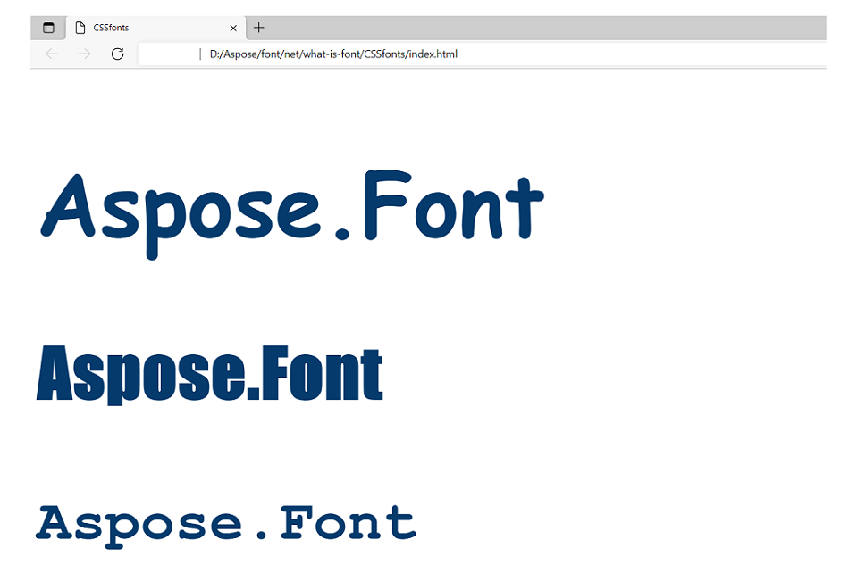
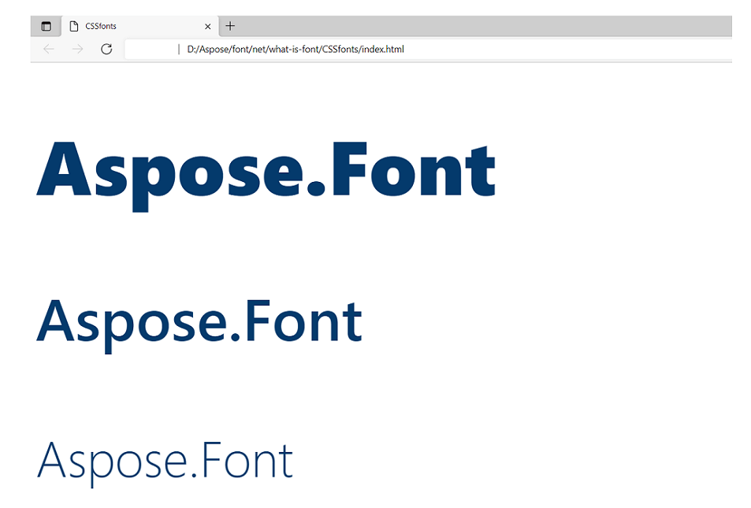
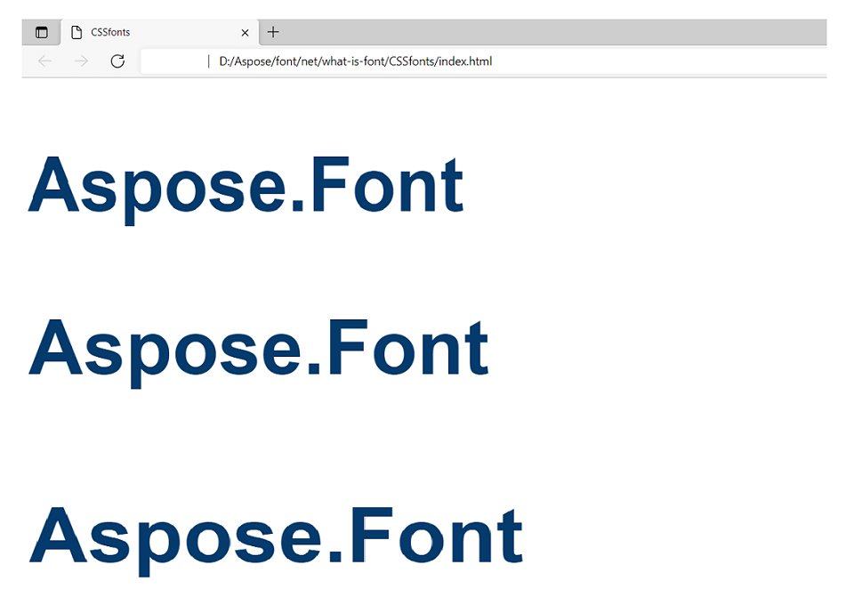
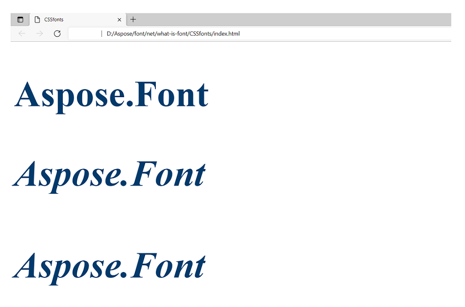
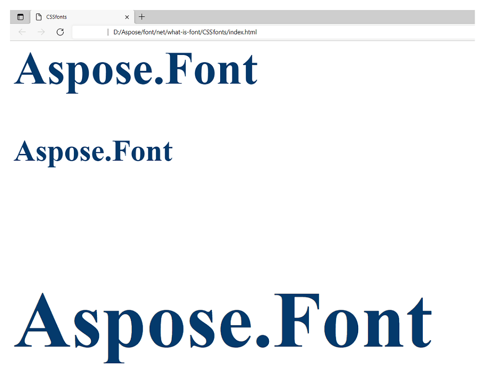
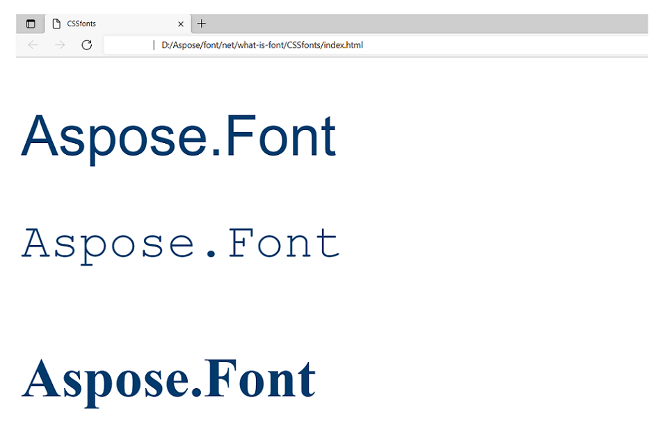
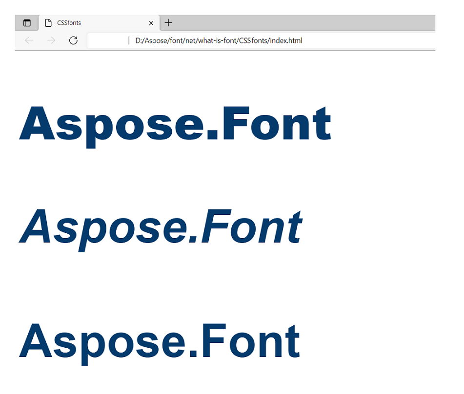

The article is aimed to teach you HTML CSS fonts and their properties, depicting with code examples how to work with them. You will learn to make your text bold or semibold, to change font size or font family in CSS and many more.

You will also see the difference between CSS font properties and the common classification of font properties. These fundamentals are described in [*What is font?*](https://docs.aspose.com/font/java/what-is-font) article.

## CSS fonts ##

The font in CSS is a resource that contains a visual representation of glyphs. To simplify, it has information that matches the glyphs with their codes.

Font resources may be set up locally on a device in which a browser works. For such fonts describing information can be obtained right from the font resource (for example from a file `montserrat.ttf`). For web fonts, such information is attached with the link on the font's resource.

Fonts in HTML CSS have next important (most often used)  properties:
- Font-family;
- Font-weight;
- Font-stretch;
- Font-style;
- Font-size;
- Font;
- Font-synthesis.

### CSS Font-family ###

Fonts with the common design are usually grouped in a font family. Inside the family, glyphs may vary in width, slope, or weight. 

CSS `font-family` property is used for typeface choosing. It is better to notify all the variations of the fonts of one type, because it is hard to predict if the font is available on the user’s computer or not. In this case, a browser will check their presence, sorting out the notified fonts one by one.

The property is inherited.

In CSS font-family has next values:
- Name of the font family (`Verdana`, `Montserrat`, `Courier`).
- Generic-family. Here you need to note one of five [*font types*](https://docs.aspose.com/font/java/what-is-font/font-types/): serif, sans serif, cursive (equal to script fonts), fantasy (equal to display fonts) or monospace.
- `initial` - sets up default values.
- `inherit` - takes after the parent its values.

**Example of using.** 
There the next parameters are set in the example.

| **Property**| **Value for text 1**|**Value for text 2**|**Value for text 3**|
| :--- | :--- |:--- |:--- |
|font-family:|Lobster, Paisfico, cursive;|Audiowide, fantasy;|Courier, monospace;|

Syntax:

// text 1
.text1 {
    font-family: Lobster, cursive;
}
// text 2
.text2 {
    font-family: Audiowide, fantasy;
}
// text 3
.text3 {
    font-family: Courier, monospace;
}


The result of applying is going to be the next (note that the font-size and color were set the same for all three texts in the `<body>`)

### CSS Font-weight ###

Font-weight property is responsible for the thickness of the font lines.

The property is inherited.

In HTML CSS font-weight may have the next values:
- `normal` - is a default value equal to 400.
- `bold` - makes the font semibold. It is equal to the 700 weight.
- `bolder` - sets the weight heavier than the ancestor has.
- `lighter` - sets the weight lighter than the ancestor has.
- `100, 200, 300, 400, 500, 600, 700, 800, 900` - where `100` makes the lightest font, and `900` makes the heaviest (boldest) font.
- `initial` - sets up default values.
- `inherit` - takes after the parent its values.

**Example of using.** 
Let’s render texts with the next parameters of font-weight.

| **Property**| **Value for text 1**|**Value for text 2**|**Value for text 3**|
| :--- | :--- |:--- |:--- |
|font-weight:|900;|500;|200;|

Syntax:

// text 1
.text1 {
    font-weight: 900;
}
// text 2
.text2 {
    font-weight: 500;
}
// text 3
.text3 {
    font-weight: 200;
}


The result of applying will look like this (note that the font-size and color were set the same for all three texts in the `<body>`). Also, it is important to remember that the used font has to have itself the weight variations needed. Most fonts are only available in `semi-bold` and `normal` weights. Font `Segoe UI` used in the example has enough font-weight variations so the text would render in all the values set in the example.

### CSS Font-stretch ###

Property `font-stretch` allows choosing normal, condensed, or expanded typeface from the font family. This HTML CSS property also does not work for every font. Only some specially designed fonts that have in their family typefaces with variant stretches can render this property. 

The property is inherited.

The values of font-stretch in CSS can be next:
- `ultra-condensed` - for the most condensed font.
- `extra-condensed` - for the second most condensed font.
- `condensed` - for a condensed font.
- `semi-condensed` - for the slightly condensed font.
- `normal` - default value.
- `semi-expanded` - for a slightly expanded font.
- `expanded` - for an expanded text.
- `extra-expanded` - for the second most expanded font.
- `ultra-expanded` - for the most expanded font.
- `initial` - sets up default values.
- `inherit` - takes after the parent its values.

**Example of using.**
 Let’s render texts with the next parameters of font-stretch.

| **Property**| **Value for text 1**|**Value for text 2**|**Value for text 3**|
| :--- | :--- |:--- |:--- |
|font-stretch:|condensed;|normal;|expanded;|

Syntax:

// text 1
.text1 {
    font-stretch: condensed;
}
// text 2
.text2 {
    font-stretch: normal;
}
// text 3
.text3 {
    font-stretch: expanded;
}


The result of applying would look like this (note that the font-size and color were set the same for all three texts in the `<body>`).

### CSS Font-style ###

This property regulates the font slope. 

The property is inherited.

Font-style property of HTML CSS may have the next values:
- `normal` - default value that sets up the normal slope for the font.
- `italic` - marks the text with the cursive.
- `oblique` - sets the sloped typeface of the font (the font has in its typeface variations a sloped one).
- `initial` - sets up default values.
- `inherit` - takes after the parent its values.

**Example of using.**
Let’s render texts with the next parameters of font-style.

| **Property**| **Value for text 1**|**Value for text 2**|**Value for text 3**|
| :--- | :--- |:--- |:--- |
|font-style:|normal;|italic;|oblique;|

Syntax:

// text 1
.text1 {
    font-style: normal;
}
// text 2
.text2 {
    font-style: italic;
}
// text 3
.text3 {
    font-style: oblique;
}


The result of applying will look like this (note that the font-size and color were set the same for all three texts in the `<body>`). 

You may have noticed that the results for `italic` and `oblique` look the same. The answer to this is that the value `oblique` works only when the font has itself an oblique typeface and the used font does not have one.

### CSS Font-size ###

The property sets the height of glyphs of the font.

It is inherited.

CSS font-size has next values: 

- Absolute size - it can be `xx-small`, `x-small`, `small`, `medium`, `large`, `x-large`, or`xx-large`. The default value is `medium`.
- Relative size - the size in comparison to the font's ancestor. Can be  `smaller` or `larger`. Can make fonts even bigger or smaller than the absolute size allows.
- Width - it is set in pixels (px) or Ems (em). EM it is a scalable unit used for web documents. One em equals the current font size. If the font size of the document is 14pt, then 1em equals 14pt. Em is scaled so 2em equals 28pt.
- `%` - this relative value is calculated in comparison to the ancestor font. It allows making more exact adjustments to the CSS font-size.
- Viewpoint width - `vw`, allows the font following the size of the window of the used browser. Note that 1vw = 1% of viewport width. If the viewport is 40cm wide, 1vw is equal to 0.4cm.
- `initial` - sets up default values.
- `inherit` - takes after the parent its values.

**Example of using.**
There the next parameters are set.

| **Property**| **Value for text 1**|**Value for text 2**|**Value for text 3**|
| :--- | :--- |:--- |:--- |
|font-size:|7vw;|70px;|2em;|

Syntax:

// text 1
.text1 {
    font-size: 7vw;
}
// text 2
.text2 {
    font-size: 70px;
}
// text 3
.text3 {
    font-size: 2em;
}


The result of applying will look like this (note that the font-family and color were set the same for all three texts in the `<body>`). 

### CSS Font ###

The CSS `font` property is used to make the code shorter. With it, it is possible to set all the other font properties in one property. There can be specified the next properties: 
`font-style`, `font-variant`, `font-weight`, `font-stretch`, `font-size/line-height`, and`font-family`. There also can be included values of `font-variant property` supported by CSS 2.1 - `normal` or `small-caps`. See [*Font variant*](https://docs.aspose.com/font/java/what-is-font/#font-variant) paragraph of [*What is font?*](https://docs.aspose.com/font/java/what-is-font/) article to get more information about this property.

**Example of using.**
 There the next parameters are set.

| **Property**| **Value for text 1**|**Value for text 2**|**Value for text 3**|
| :--- | :--- |:--- |:--- |
|font:|6vw `Arial`;|60pt `Courier`, monospace;| - |

Syntax:

// text 1
.text1 {
    font: 6vw Arial;
}
// text 2
.text2 {
    font: 60pt Courier, monospace;
}
// text 3
.text3 {
}


The result of applying these parameters is in the picture below (note that the color is set the same for all three texts in the `<body>`). As we did not set any values for the third text, it was rendered in default parameters.

### CSS Font-synthesis ###

This HTML CSS property defines if it is allowed for browsers to synthesize semibold or oblique font styles if they are absent in the font family. So if `font-weight` and `font-style` are not specified, browsers must not synthesize semibold or oblique styles.

The property is inherited.

For CSS font-synthesis parameter next values may be set:
- `none` - forbids the synthesis.
- `weight` or/and `style` - noted property/properties are allowed to be synthesized.
- `initial` - sets up default values.
- `inherit` - takes after the parent its values.

**Example of using.**
 There the next parameters are set.

| **Property**| **Value for text 1**|**Value for text 2**|**Value for text 3**|
| :--- | :--- |:--- |:--- |
|font-synthesis:|weight;|style;|none;|
|font-weight:|900;|-|900;|
|font-style:|-|oblique;|oblique;|

Syntax:

// text 1
.text1 {
    font-synthesis: weight;
    font-weight: 900;
}
// text 2
.text2 {
    font-synthesis: style;
    font-style: oblique;
}
// text 3
.text3 {
    font-synthesis: none;
    font-weight: 900;
    font-style: oblique;
}


The result of applying would render as it is shown in the next image (note that the color is set the same for all three texts in the `<body>`). As we set the `none` value for the third text, it was rendered in default parameters.

## Conclusion ##

The CSS font is one of the key blocks in developing interfaces with CSS. Most of the content of the majority of web pages is text content, so without learning this property this content will never have a high-quality look. It will have less readability, scalability, etc. 

Some properties are easy to apply to any font, but some properties need a special font that supports the variation of the property. Like font `Inconsolata` has 8 variations of font-weight when most fonts can only be `normal` or `bold`. 
If you have in mind a font you want to use but you do not have it on your device, you may try to find and download it from a free web application from Aspose. Apart from that, [*Font Viewer*](https://products.aspose.app/font/viewer) will provide you with the necessary information about the font you may need when developing.

