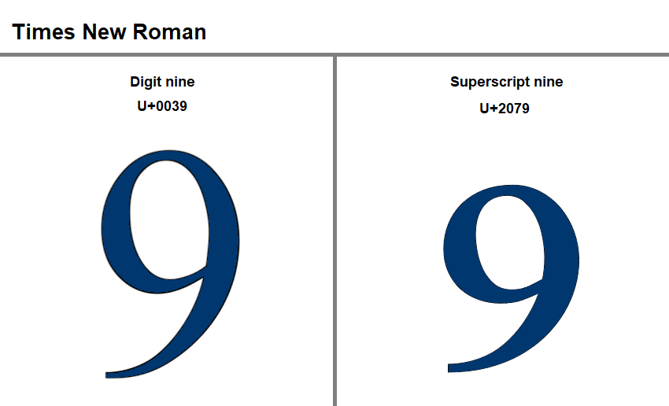
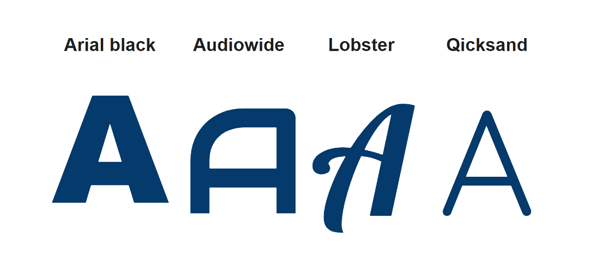
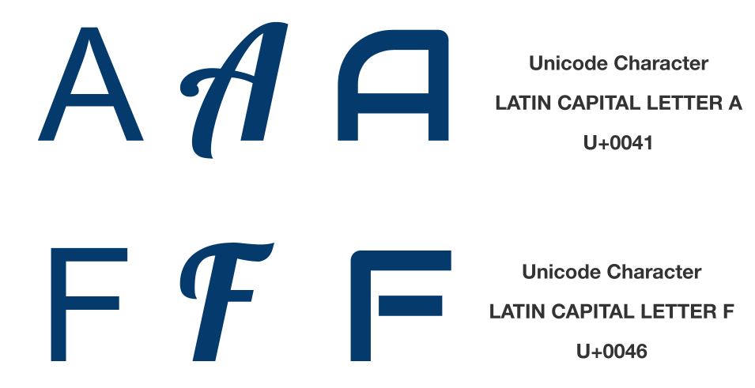
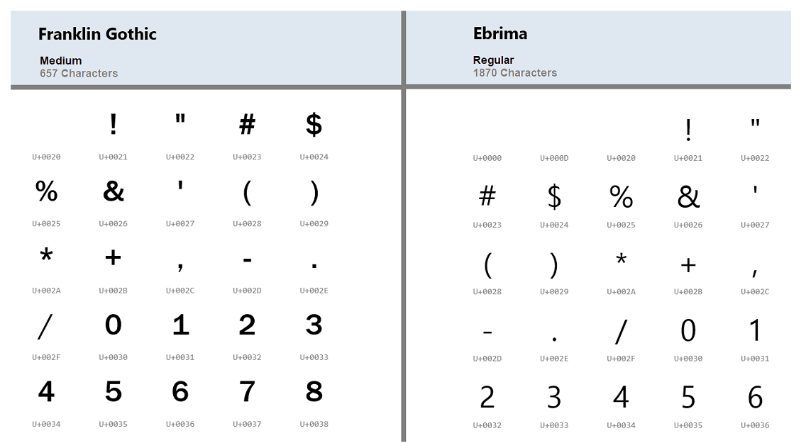
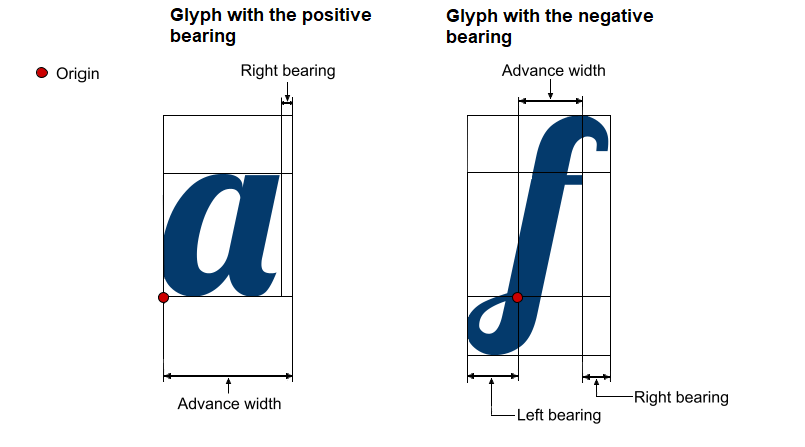
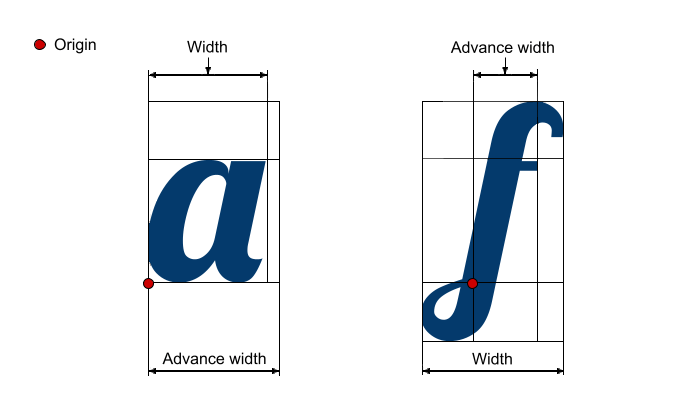
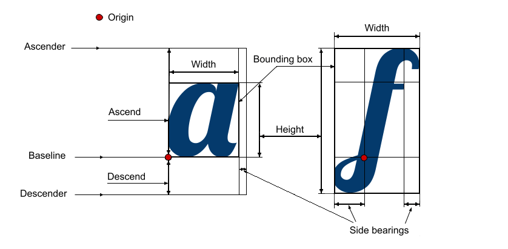
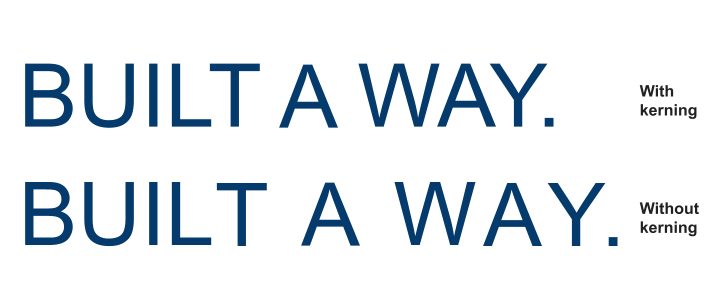

As any font contains glyphs and cannot exist without glyphs. Learning fonts cannot be fulfilled without learning about glyphs. Manipulating fonts in any sphere: programming, design, typography won’t be successful without understanding the role of glyphs. This article is aimed to help you understand the glyph fundamentals.

## What is glyph? ##

There are many definitions of the term **Glyph**. We are going to give you a few of them.

**Glyph** is one individually designed character of a typeface, or as it was described in the article [*What is font?*](https://docs.aspose.com/font/java/what-is-font/) it is a graphical representation of a symbol/character. 
Not only each character has a glyph but may also the character be represented by a few alternative glyphs. 
You can see an example of such a case in the picture below. Here symbol `9` is given in the `Times New Roman` font represented in two glyphs. As you can see they also have different unicode and name.

But sometimes one character can represent characters of different scripts. Like capital `T` is the same for English, Russian, German, and many more languages. And it is counted and represented as a separate glyph. The same character of a different font is a separate glyph too, as it has its own design.

In the picture below are depicted four glyphs of a capital letter  `A` in different fonts. 

And looking at the image comes to mind another definition of **Glyph** as the graphical unit of a font.

In developing it is important to have in mind the definition of **Glyph** as an encoded character. To simplify,  any glyph ought to have a standardized code used to reference this glyph across the font. The most known standard of glyph codes is Unicode. Unicode пgives the same code to a glyph in every font of every font family where this glyph exists. 

Each glyph has a lot of encoding data. The table below shows some of this data for a glyph `@`

| **Where to use**| **Encoding data**|
| :--- | :--- |
|HTML Entity (decimal)|&#64|
|HTML Entity (hex)|&#x40|
|How to type in Microsoft Windows|Alt+0040  Alt064  Alt64|
|UTF-8 (hex)|0x40 (40)|
|UTF-8 (binary)|01000000|
|UTF-16 (hex)|0x0040 (0040)|
|UTF-16 (decimal)|64|
|UTF-32 (hex)|0x00000040 (0040)|
|UTF-32 (decimal)|64|
|C/C++/Java source code|"\u0040"|
|Python source code|u"\u0040"|

 ## Glyphsets ##

**Glyphset** is a composition/collection of glyphs that forms a font. Each font has a different number of glyphs in its glyphset. For example, Arial includes 4503 glyphs, while Montserrat, - 1943 glyphs.
 
{}
To find out how many glyphs are in a particular font, you may use a free application from Aspose. It is easy to use [*Font Viewer*](https://products.aspose.app/font/viewer). 
It will give you information about font source, description, designer, license, file name, font name, font family, style, postscript name, version, etc.
{}

Each font file contains a glyphset. 
Each font file also contains one or more tables. These tables are known as **character maps**. It is like a table with cells filled with characters/glyphs. Each cell/slot has a code and by this code, the needed glyph is indexed, found, represented, and then rendered. These tables are similar by the number of cells but not similar by cell filing. As it was mentioned before, each font has a different size of the glyphset. Because of that for one font some cells will be filled with characters but for another font, these same cells may be empty.

The next picture shows the difference in glyphsets of Franklin Gothic and Ebrima fonts. There they are indexed by Unicode.

## Glyph metrics ##

**Glyph metrics** are the parameters that influence how the glyph is positioned when the text layout is created.

Glyph metrics are usually divided into:
- Horizontal metrics (Latin, Cyrillic, Arabic, etc.);
- Vertical metrics (Chinese, Japanese, Mongolian, etc.)

The most know glyph’s metrics are:

- **Advance width** is the space that a glyph takes. It is the width of the line from the origin point of the glyph to the origin point of the next glyph.
- **Origin** - is the point where one symbol ends and the next one  starts.
- **Side bearings** - is white space on the left or right side of the glyph. Sidebearings may be negative (when a glyph takes more space than the advance width is) or positive (a glyph takes less space than the size of the advance width). The difference is explained in the image.

- **Baseline** - is an invisible line that is used to position the glyphs.
- **Ascent** - is the length from the origin point on the baseline to the highest point of the glyph.
- **Ascender** - is the horizontal line that goes through the highest point of the highest glyph of the font. It is also called the **ascent line**.
- **Descent** -  is the length from the origin point on the baseline to the lowest point of the glyph.
- **Descender** - is the horizontal line that goes through the lowest point of the lowest glyph of the font. It is also called **descent line**.
- **Bounding box** - is a square that frames the visible parts of the glyph.
- **Height** - is the vertical size of the glyph bounding box. 
- **Width** - is the horizontal size of the glyph's bounding box. Typically, **width** is less than **advance width** but for some glyphs, the situation is the opposite. The difference between these two values is shown in the image. 

You can learn all the previously described metrics in the picture below.

## Kerning ##

Speaking about glyph metrics, it is necessary to mention another term related to it, - **kerning**. Usually, the space between glyphs is equal by default, but some combinations would look loose if it was so. The example of such combinations are `LT`, `WA`, `YA`, etc. **Kerning** adjusts space between glyphs so the words in text would look smooth. The picture below shows the difference that kerning gives.

Not every font format includes kerning information. Moreover, some kerning formats are not supported by some fonts, like True Type fonts, for example. So it may be useful to convert the font format in this case. Here Aspose [*Font Converter*](https://products.aspose.app/font/conversion) comes in handy.

## Conclusion ##

In the article was given some common information about the term **glyph** and its metrics. Aspose.Font has a more advanced solution if you need to manipulate fonts, glyphs, and their metrics. 
To see what functional for working with glyphs you can get from using it, have a look at [*Glyphs*](https://reference.aspose.com/font/java/com.aspose.font/Glyph)class of [*Aspose.Font for Java*](https://reference.aspose.com/font/java/) library.

