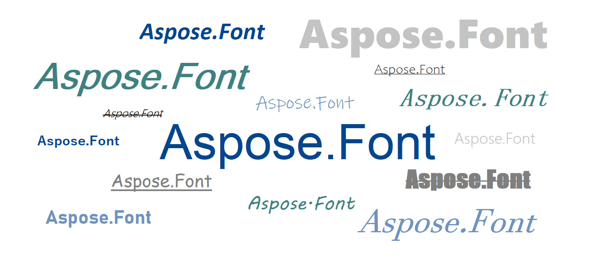

## What is Font Formatting? ##

Font formatting is the process of altering the visual appearance of text in a document or digital content. Here [font properties](https://docs.aspose.com/font/net/what-is-font/#font-properties) like font type, size, color, style (such as bold or italic), and alignment can be changed. Font formatting is used to improve the readability and the appearance of the text. It is also used to highlight some significant information or to zone different areas on the page. It is some of the critical tasks of graphic design and is commonly used in word processing software, web design, and other digital solutions.

### Difference between font formatting and font format ###

You may mix up the two terms as they sound pretty similar. It may seem that there is no significant difference between "font formatting" and "font format" as they both influence the way text looks on a page. However, "font formatting" is a more commonly used term for working with the settings by changing the values of font properties. [Font format](https://docs.aspose.com/font/net/what-is-font/font-formats/) is about the specific file format used to store and display fonts, such as TrueType or OpenType. In some cases, to format fonts, you do not need any specific knowledge, like when you change the size of your text or make it bold in a text editor. Understanding the font "format term" is needed less often, when you choose the proper one fitting to the requirements of your project.

In general, "font formatting" is a broader term that encompasses different formatting options, while "font format" refers specifically to the file format of the font itself.

## Types of font formatting ##

There are several types of font formatting that can be used to improve your texts. Let's describe the most used of them:

| **Type** | **Description** |
| :--- | :--- |
| **Bold** | It makes the text appear thicker and darker. It is usually used to highlight its importance. |
| **Italic** | Makes the text sloped slanted to the right, which can be used to denote emphasis or a change in tone. It is often used for anchor texts, or to make the text feel as if handwritten.|
| **Underline** | Adds a line under the text. It is usually also used to indicate emphasis. When hovering over a hyperlink the text becomes underlined too. |
| **Strikethrough** | The formatting where the text has a line drawn through the center of each character. It is used to indicate that it has been deleted or is no longer relevant, or is not true. |
| **All Caps** | The text with all the letters of the upper register. It is used to highlight the urgency or importance of the message. |
| **Small Caps** | Here all the letters appear as if in the upper register but have the size of the lower register. |
| **Subscript** | Here the text is smaller and lower than the main text. It is often used in math, chemical, physical formulas, and equations. |
| **Superscript** | Here the text is smaller but higher than the main text. It is often used for exponents or to indicate footnotes. |

These are just a few examples of the different ways that font formatting can be used.  You can also format a font by changing its color or highlighting it with the background color.

It may seem obvious why you would need to format text, but let's go a little deeper and see how the font size, color, and style impact the text.

## Role of Font Formatting ##

Why would you need to spend time on font formatting? Is it worth it?

With the properly-styled texts, you will be able:

- **To set the tone of the text**. - Formal documents usually use neat, black, Arial, or Times New Roman fonts of a certain size 12 or 14, while wedding invitations, for example, may use sloped fantasy fonts of different colors.
- **To structure the text**. Using different styles, sizes, and colors you can highlight that the texts are divided into separate blocks and to point the headers of these blocks.
- **To improve the readability of the text**. Too small text can be difficult to read, while too large text can be distracting. It is essential to choose a font size suitable for the context and audience. This can be also done with the color of the text, especially when it is used in combination with the background color. The contrast between these two parameters is important, as the text needs to stand out from the background for easy reading. Different [font types](https://docs.aspose.com/font/net/what-is-font/font-types/) also have different levels of readability. Some [script fonts](https://docs.aspose.com/font/net/what-is-font/font-types/#script-fonts) may be too fancy and hard to read, while [monospace fonts](https://docs.aspose.com/font/net/what-is-font/font-types/#monospace-fonts) look good in programming code but are too wide and take up much space to use for the whole project.
- To create **branding** for the project. Using standing-out fonts, like display ones, in your logos, mottoes, advertisements, and other marketing materials can make customers attract attention and recognize your products among competitors.

So as you can see, the correct selection and use of font type, size, weight, color, and style can greatly improve the readability, tone, and impact of the text.

## Font Formatting standards ##

You do not just format the texts the way you like or want, to get all the benefits of font formatting you need to follow standards, rules, and guidelines. These standards were made to ensure readability and make it easier for readers to understand the information. In some spheres, like term and scientific papers, these standards are very strict. And your work might not be published if you did not follow them.

| **Standart** | **Description** |
| :--- | :--- |
| **Font type** | Sans-serif fonts are considered to be better for online projects, and serif fonts, -  for print materials and publishing. |
| **Font size** | It should be large enough so the user can read it easily, typically between 10 and 14 points. In some cases like content for kids, the size may be much bigger. |
| **Bold and italic** | Bold or italicized text can be used to emphasize important points or headings. Such styling should be used carefully not to draw the attention of the user from important parts. Sloped(italic) texts may be more widely used, for whole paragraphs, to separate the author's notes from the main text, for example. |
| **Alignment** | It is usually expected that the text is aligned to the left, except for headings or titles, which may be centered or aligned to the right. For papers, the main text is usually justified. |
| **Line spacing** | When choosing adequate line spacing (leading) you rely on two criteria: user's comfort and space taken by the text. It is recommended to use line spacing of 1.5 or double spacing. |
| **Capitalization** | The major rule is: the first letter of the first word is capitalized and subsequent words are in lowercase, except for proper nouns. Be careful with capitalization, as, for example in texting, overusing Caps Lock may be considered as an aggressive tone. |
| **Color** | Black text on a white background is a common choice, but if you are not writing any papers, you may use any color scheme you like for your project. You just only have in mind that the colors of the text and the background must have significant contrast, so it is easy to read. To be sure the contrast is fine you may try the online [Color Contrast Checker](https://products.aspose.app/html/contrast-checker). |
| **Bullets and numbering** | They can be used to organize lists or steps. It is recommended to use numbered lists for sequences of actions and bullet lists for the enumeration of items, options, etc. |

There are also worth mentioning recommendations for [CSS Fonts](https://docs.aspose.com/font/net/what-is-font/css-fonts/). There formatting is done by using properties Font-family,  Font-weight, Font-stretch, Font-style, etc. There are a few additional rules to code fonts in CSS:
- Include a fallback font family in case the user does not have the primary font installed on their device. 
- It is better to stick to sans-serif fonts.
- Test the accessibility of the chosen fonts.

## Best Practices for Font Formatting ##

As the conclusion to the article, I would like to mention some common recommendations for font formatting in your project.

- **Use font hierarchy and stick to it.** 
If working in some text redactors you could use the already included formatting for the Title, and headers of different levels in your own project you can style these structure elements your own way using font weight, style, and size. Just make sure that all the elements of the same type(level) have equal formatting.
- **Choose comfortable font sizes.** 
This simple step may have a big impact on the readability of your text. Make sure your font sizes are large enough to read, especially for users with visual impairments. The smallest recommended size is considered to be 16 pixels.
- **Do not neglect whitespace.**
Not only are big solid paragraphs hard to focus on but also it may be better for SEO to separate texts with whitespace and start each of them with some relevant to your content keywords. 
- **Limit the number of fonts.** 
Having too many different fonts makes your project look messy and unprofessional.  It will also be hard to track all the fonts so that none of them fall and all of them are up to date.
- **Use font pairing software.**
If there is more than one font used in your design, make sure they get along well. There are many cross-platform solutions for this available.
- **Choose web-safe fonts.** 
Web-safe fonts are those that have been pre-installed on most computers and devices, regardless of their operating system or software. Arial, Helvetica, Times New Roman, and Verdana are among the representatives.
Using them on your website ensures that the text displays well across different devices and browsers. This is important because if you use a font that is not available on a user's device, their browser will try to substitute it with a similar font. This can result in the text appearing differently than you expected. this will also may affect the readability significantly.
- **Test fonts before launching.**
This will ensure that all the texts are rendered correctly and fully on different devices and browsers. Also, let users provide you with feedback on the readability and accessibility of fonts.

Add these simple rules to the checkup list so you can follow them to be sure your texts are readable, visually appealing, and accessible to all users.
