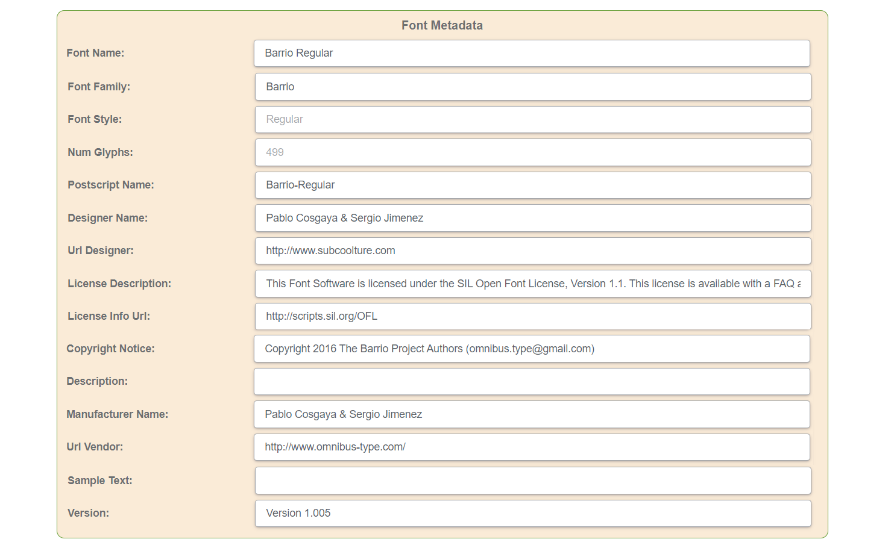

## Metadata of a file ##

Let's start with the definition of metadata in common to then understand its meaning for fonts.

Metadata of a file is information about the file that is stored along with the file or in a separate database. This information includes details about the file's format, creation date, author, location, size, and other attributes. Metadata can also include information about the content of the file, such as keywords, tags, and descriptions.

You can see some Metadata on your device(see the picture below). It is important for managing and organizing files, as it allows you to search, filter, and sort files relying on different criteria. For example, it is common to arrange the content of your folders relying on the date the files were created. Or in some cases, you may need to arrange your files in alphabetical order. Metadata is also used by software applications to display and manipulate files correctly, as well as by operating systems to index and search for files on a computer.

## What is Font Metadata? ##

Font metadata refers to information about a font embedded within the font file itself. This is information like the font name, the designer's name, the font version number, the copyright information, and the font's usage restrictions. Some files can also include the font's character set, its encoding, and its metrics information. This data helps define the way the font is placed in the text and is important for font identification, licensing, and management. Font metadata is often used by software applications to display and manipulate fonts correctly.

## Types of Font Metadata ##

Font metadata can include various types of information. Here is the list of them grouped in the table:

| **Type** | **Description** |
| :--- | :--- |
| **Font name** | Unique identifier used in the PostScript language to refer to a particular font. It is typically a shortened version of the font's full name limited to 29 characters. This metric is used to identify the font within a PostScript document and is often required when embedding or outlining fonts. |
| **Postscript Name** | Unique identifier used in the PostScript language to refer to a particular font. It is typically a shortened version of the font's full name limited to 29 characters. This metric is used to identify the font within a PostScript document and is often required when embedding or outlining fonts. |
| [**Font family**](https://docs.aspose.com/font/net/what-is-font/#font-family) | In short, it is a group of related fonts of similar characteristics, such as weight, style, and width. |
| [**Font style**](https://docs.aspose.com/font/net/what-is-font/#font-style) | It divides fonts into regular, italic, bold, or bold italic. |
| [**Font weight**](https://docs.aspose.com/font/net/what-is-font/#font-weight) | It stands for the thickness or heaviness of the font, from thin to ultra-bold. |
| **Font width** | The relative width of the font, from condensed to expanded. |
| **Font designer** | The name of the individual or company that created the font. |
| **Manufacturer Name/Font foundry** | The name of the company that created or distributed the font. |
| [**Character set**](https://docs.aspose.com/font/net/what-is-font/font-subsetting/) | The set of characters that the font supports, which can include letters, numbers, symbols, and punctuation marks. |
| **Num Glyphs** | The information about the number of [glyphs](https://docs.aspose.com/font/net/what-is-font/glyph/) in the font. |
| **Font version** | Specific version or release of the font. |
| [**Font format**](https://docs.aspose.com/font/net/what-is-font/font-formats/)| The file format in which the font is stored, such as TTF, WOFF, Type1, etc. |
| **Font licensing information** | This information is divided into **License Description** and **License Info Url**. License Description explains the terms and conditions under which the font can be used. It can vary depending on the [type of license](https://products.aspose.com/font/cpp/extract-licensing-information/). |

To see all the metadata enclosed in the file you may use specific software or cross-platform applications like the one Aspose has in its ecosystem. [Font Metadata Viewer](https://products.aspose.app/font/metadata/) now lets you get information about TTF, WOFF, and WOFF2 fonts.

## Use of Font Metadata ##

Font metadata is used to provide additional information about a font, beyond just its design and appearance. It includes different common information and also technical details.
But what is the point of all this information and how it can be used?

- **Copyright and licensing**. - Font metadata can include information about the font's license, such as whether it is free for commercial use or if it requires payment or attribution. It provides a license description,  URL to the license,  and copyright information which can be used to ensure that the font is used legally and appropriately.
- **Proper font identification**. - Providing information about a font, such as its name, designer, foundry, and version number font metadata helps ensure that the font is correctly identified and used.
- **Language support** is another example of metadata that can be useful. You can find it in the information about which glyph sets are included.
- **Searchability**. - Users use certain metadata to categorize and organize fonts based on different criteria, such as style, weight, or designer. This makes it easier to search and get to the right font if needed.
- **Accessibility**. - Font metadata may include information about the font's legibility and readability, which can be useful for people with visual impairments.
- **Support for non-Latin symbols.** -  Font metadata can include information about the language support and Unicode ranges of a font.  You may use such data if you have a multi-language project with languages that use non-Latin scripts, such as Arabic, Chinese, or Hindi. This metadata helps you make a proper choice in this case.
- **Size of the font file**.  - If you take a look at the Metadata that shows the number of glyphs in the font, you can also understand if this file is suitable for your project or not, because the more glyphs there are in it the heavier the font file is. Big overloaded font files not only take much space but may also be messy to manage.
Overall, font metadata plays an important role in helping designers, developers, and users manage and work with fonts in a more efficient and effective way and help ensure that fonts are properly identified, accessible, and used legally and appropriately.

## How do operating systems use font metadata? ##

The way font metadata is used is already explained, so let's have a look at how operating systems use it for fulfilling the above mentioned functions.

- **Proper font identification** - When a user selects a font, the operating system reads the metadata to determine how to render it. The information about the font file's characteristics and properties, such as the font family, style, weight, and size helps the operating system ensure that the font is displayed consistently across different applications and devices.
- **Copyright and licensing**. - Font creators embed copyright and licensing information in the font metadata. It gives users a legal framework for using the font. This data allows the operating system to verify that the font is licensed correctly and to prevent its unauthorized distribution or use.

Font file formats, such as OpenType and TrueType, also support digital rights management features. DRM features use metadata to enforce licensing restrictions and can limit the number of devices or users with access to a font, prevent font embedding in documents, and restrict usage of the fonts to specific apps or platforms.

## Standardizing Font Metadata ##

Font metadata standards are sets of guidelines and specifications to define the information and data that should be included with a font file. There are several different metadata standards for fonts, including OpenType, TrueType, and PostScript fonts. Each of them has its own specific requirements and formats.

### Metadata standards for OpenType fonts ###

The metadata standard for [OpenType fonts](https://docs.aspose.com/font/net/what-is-font/font-formats/#opentype-font-format) is called the **OpenType Font File Specification**. It includes guidelines on how to include metadata that can be stored within the font file itself, in a separate file alongside the font, or embedded in the font's digital signature.

OpenType Font File Specification also describes how fonts can include additional information about their features and capabilities. This information is stored in a separate table within the font file, called the OpenType Layout table which has data such as language support, glyph substitution, and positioning rules, along with other advanced typographic features.

### Metadata standards for TrueType fonts ###

OpenType Font File Specification also defines a standard format for [TrueType fonts](https://docs.aspose.com/font/net/what-is-font/font-formats/#truetype-font-format). It includes a variety of metadata fields. Let's take a look at the key ones(some of them were already described):
- **Font Family Name**.
- **Font Subfamily Name** - the name of the individual font style (typeface).
- A **unique identifier** for the font, such as a version number or the one assigned by the font creator.
- **Full Font Name** that consists of both the family and subfamily names.
- **Designer Name**.
- **Description** of the font's design characteristics.
- **License** information.
- **Trademark** gives information about any trademarks associated with the font.

### Metadata standards for PostScript fonts ###

It is a set of guidelines to organize and present information about a font, such as its author, license, and design characteristics. This is the Adobe [Type 1 Font Format](https://docs.aspose.com/font/net/what-is-font/font-formats/#type-1-font-format) that defines a standard format for PostScript fonts, which includes a variety of metadata fields like:
- **FontName**. - The field for the name of the font that is unique within a PostScript interpreter.
- **FullName**.  - The field to specify the full name of the font.
- **FamilyName**, - for the name of the font family.
- **Weight**.
- **FontBBox**. - The bounding box of the font. It is needed to define the minimum and maximum x and y coordinates for the glyphs.
- **Notice**. - The field for Information about the license and copyright.
- **UniqueID**. -  Has a unique identifier for the font.

### Metadata standards for WOFF fonts ###

[Web Open Font Format](https://docs.aspose.com/font/net/what-is-font/font-formats/#web-open-font-format) is designed for use on the web. Metadata standards for WOFF fonts are defined by the **WOFF File Format Specification**. The fields with the metadata according to it look the next way:
- **family**, - for the family name.
- **style**, - for information about font style.
- **weight**, - includes parameters of the font-weight.
- **stretch**, - includes parameters of the [font-stretch](https://docs.aspose.com/font/net/what-is-font/css-fonts/#css-font-stretch).
- **designer**, - for font creator's name.
- **license**.
- **description**.
- **vendor**.

Overall, different font formats have different standards of metadata included. It is defined by specifications and includes information about the fields that can be present in the metadata and the format of those fields. They are mostly similar for all the font formats but the names of the fields may have different formatting.

## Best Practices for Font Metadata ##

There are a few recommendations on how to write font metadata. Following them, you will ensure the fonts are easy to identify and accessible to users. 

1. Use consistent naming conventions across all metadata fields. It will make it easier for users to browse your fonts.
2. Include complete information about your font.
3. Write descriptions and other metadata fields in a simple and clear way, without complex sentences, terms, and local expressions.
4. Use standard metadata fields that are widely recognized across different font formats. 
5. Use unique identifiers to prevent conflicts with other fonts and make your ones distinguishable.
6. Keep your font metadata regularly updated.

These simple rules will help users choose your font among the big variety of competitors and eliminate future miscomprehension.

## Conclusion ##

Font metadata can be a good tool to make your font more competitive. Understanding what information to add and how to write it properly will make your fonts more attractive, and professional looking to users. Adding all the necessary data and keeping it properly standardized and updated will help to get rid of possible misunderstandings with customers. It will also help protect fonts from pirating.