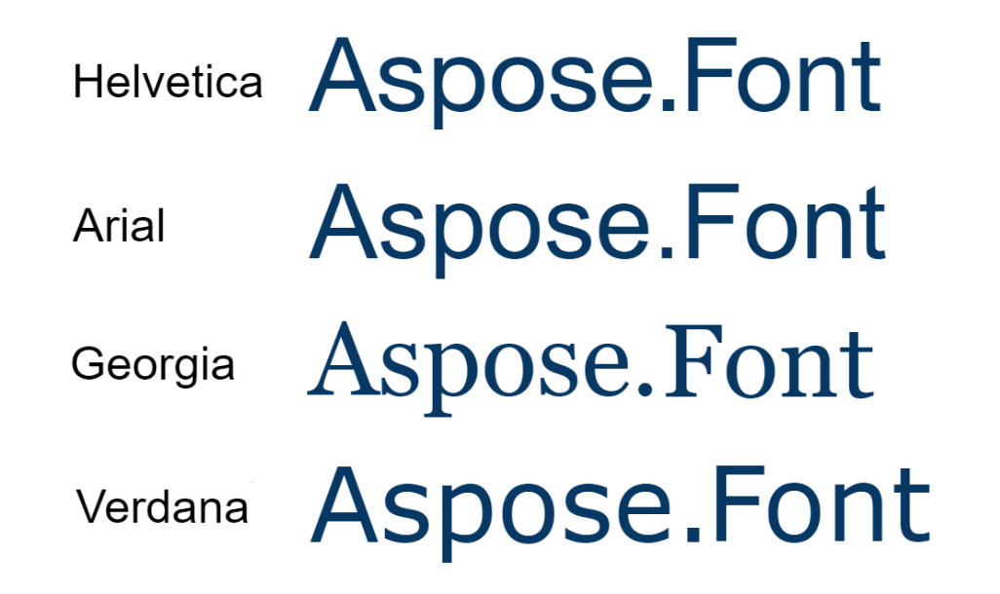

Font hinting is another tool to improve how fonts look on various screens. The more diversity of devices we get the more complex processes of adapting content to each type and size of the screen should be used. Here we are going to explain the process to you, its role, types, and limitations.

## What is font hinting? ##

Font hinting is the process of adding instructions to a font file to ensure that characters are displayed clearly and readably on screens depending on their different resolutions and sizes.

The designers and developers modify the outlines of fonts so you get a sharp picture of the text on even low-resolution devices, such as computer monitors and mobile devices.

When text is displayed on a screen, the pixels of the display are often much larger than the fine details of a font. This can make letters to seem blurry or unclear and so difficult to read. Font hinting provides instructions to adjust the font's design to align with the pixel grid of the screen. As a result, we get crisper and clearer text.

This hinting information includes the exact placement of each line and curve in the font and information on how to adjust the spacing between characters. With this data, the computer can render the font more accurately on any display, improving the legibility and appearance of the text.

## The purpose of font hinting ## 

As was already mentioned the purpose of font hinting is to ensure that characters in a font appear sharp well at small sizes. It is particularly important for fonts that will be used on low-resolution displays, such as those found on mobile devices or older computer monitors. By providing hints to the renderer, the font can be optimized for the specific display technology being used to get clearer and more readable texts. For better results, it also can be combined with antialiasing and (on liquid crystal displays) subpixel rendering for even better clarity.

Hints can include information such as stroke thickness, character spacing, and shape adjustments. It is really important for fonts that have thin strokes or complex shapes, as they can become blurred or distorted without the additional guidance provided by hints.

Unhinted fonts are designed to work on larger sizes or on high-resolution screens where hinting is unnecessary. They may appear jagged or blurry when displayed at small sizes on low-resolution screens, as they do not have the embedded data needed to optimize them for display at that size.

Let's look at how simple English texts and examples of hieroglyphs without font hinting would be scaled.

###  Outline fonts ### 
Font hinting is used in so-called outline fonts. The most used [formats](https://docs.aspose.com/font/net/what-is-font/font-formats/) of them are PostScript Type 1, TrueType, and OpenType.

**Outline fonts** are those created by defining the outer edges or contours of each character, rather than using a bitmap or pixel-based representation.

Instead of specifying the exact placement of each pixel of a glyph, these fonts use mathematical formulas to define the curves and lines that make up each character. This approach allows the font to be scaled up or down losslessly.

Outline fonts are commonly used in graphic design, typography, and desktop publishing applications, as they provide a high degree of flexibility and can be customized to suit a variety of design needs. They are also widely supported by both Mac and Windows operating systems, making them a popular choice for cross-platform design projects.

## What techniques are used in font hinting? ## 

Font hinting uses different techniques. Let's take a brief look at some of them:

- **Stem hinting:** It adds hints to the vertical and horizontal strokes of the characters to make them aligned and of consistent thickness. This helps prevent the strokes from looking too thin or thick.
- **Blue zone hinting:** It adds hints to the areas of the font where glyphs tend to have curved or diagonal strokes, such as the lowercase letters "a", "g", "y", and "j". Here hints help ensure that these areas are rendered smoothly and clearly.
- **Delta hinting:** It adjusts the position of each individual point in the font's outline to optimize glyph rendering. This technique is pretty challenging and time-consuming, but it helps improve the overall legibility and appearance of the font.
- **Grid-fitting:** It alights the font's outlines to a grid so each pixel is accurately represented. This technique can help prevent distortion or blurring of the font.

## Pros and cons of Font Hinting ##

Font hinting is an [algorithm of font rasterization](https://docs.aspose.com/font/net/font-rasterization/#algorithms-of-font-rasterization) and as any other algorithm, it has its drawbacks and benefits that are worth mentioning.

| **Pros** | **Cons** |
| :--- | :--- |
| Improved legibility of small-sized fonts on screens by ensuring that the edges of the letters are clear and sharp, making the text easier to read. | Hinting can be a complex and time-consuming process, with specialized skills and knowledge required. You may also need multiple versions of the font for different platforms and devices. |
| Hinting can help compensate for the limitations of low-resolution screens, so the font appears as intended even on screens with fewer pixels. | Hinting locks in specific shapes and positions for the glyphs. This reduces the flexibility of the font and limits its potential uses.|
| Consistency across different platforms and devices, regardless of differences in screen size or resolution. | If the hinting is not done correctly, it can actually reduce the legibility of the font or cause rendering issues. |
|  | It can increase the size of a font file, especially for highly hinted fonts. |

## Limitations of font hinting ##

Apart from the pros and cons mentioned, it is worth also talking about the limitations of this technique. They are:
- As display technology has improved so that the difference in quality between a hinted and an unhinted font is less noticeable, the need for hinting has decreased.
- The process can be time-consuming and expensive and this cost is usually passed on to customers, making fonts more expensive.
- Hinting instructions can be incompatible with certain devices or software.
- Font hinting is typically done for Latin-based languages, and may not be effective for languages that use different glyph sets or have complex glyphs, such as Arabic, Bengali, or Chinese.
- Font hinting can limit the design options, as certain design choices may not be compatible with hinting instructions.

## Font hinting types ##

There are two different techniques used to improve the legibility of text on computer screens or in print: TrueType and PostScript hinting.

If briefly comparing, TrueType hinting is optimized for on-screen display, and PostScript, - for printing. TrueType hinting is typically used in operating systems such as Windows and macOS, and PostScript, - in high-quality printing environments. Both techniques can significantly improve the readability of text, particularly at small sizes. 

### TrueType hinting ###

**TrueType hinting** adjusts the outlines of each character to fit within the limited pixel grid of computer screens. This process involves adding "hints" to each glyph to give instructions to the computer on how to best display it at small sizes. These hints are based on a combination of mathematical algorithms and manually crafted adjustments  optimized for legibility and consistency.

TrueType hinting was developed by Apple in the late 1980s. It is still widely used and is supported by most modern operating systems and applications.

### PostScript hinting ###

**PostScript hinting** adjusts the outlines of each character to fit within the limitations of printing technology. This process involves adding instructions to a font file to tell a printer how to adjust the shape of each character to fit within the grid of the printer. These instructions are based on specific printer technology and vary depending on the printer.

PostScript hinting uses different types of hints: stem hints, counter hints, and serif hints, and applies them to the outlines of each glyph. This process can be time-consuming and requires a high level of expertise in font design and engineering.

PostScript hinting is a type of font hinting technology developed by Adobe Systems for its PostScript language and Type 1 font format. It is still used today in the printing sphere. However, it has been largely superseded by newer technologies such as TrueType hinting and ClearType better optimized for modern printing devices.

## What is the process of font hinting? ##

Here are the basic steps that should be taken in the font hinting process:
1. The designer creates a font using vector-based design software like Adobe Illustrator or FontLab.
2. Then they identify areas of the font that may need hinting, such as small strokes, curves, or diagonal lines.
3. Here the hinting values are set. These values may include instructions on how to adjust the spacing, shape, or alignment of certain glyphs.
4. The font is texted in various sizes and on different screens.
5. The designer adds hinting instructions to the font file. After this step, it is ready for use.

## What is the most readable font? ##

As font hinting is all about increasing readability you may also consider which font is the best in this characteristic. The answer to this question highly depends on the needs of your project and your taste.  But here are a few [typefaces](https://docs.aspose.com/font/net/what-is-font/#glossary) considered to be highly readable and legible:
- **Helvetica** - a simple, clean, and timeless [sans-serif](https://docs.aspose.com/font/net/what-is-font/font-types/#sans-serif-fonts) font often used in print and digital media due to its easy readability.
- **Arial** - a sans-serif typeface similar in appearance to Helvetica, and also commonly used in digital media and publications.
- **Georgia** - a [serif](https://docs.aspose.com/font/net/what-is-font/font-types/#serif-fonts) font that was designed for digital. It looks slightly more traditional than sans-serif fonts. It has wide letter spacing and curved lines making it highly readable on screens.
- **Verdana** - a sans-serif font that was specifically designed for on-screen readability. It has a large size and generous spacing between letters making it highly legible even at small sizes.

## Conclusion ##

With the increasing use of high-resolution displays, font hinting may become less relevant in the future. However, until high-resolution screens become the norm, font this technique will remain an important tool in font and web design.

