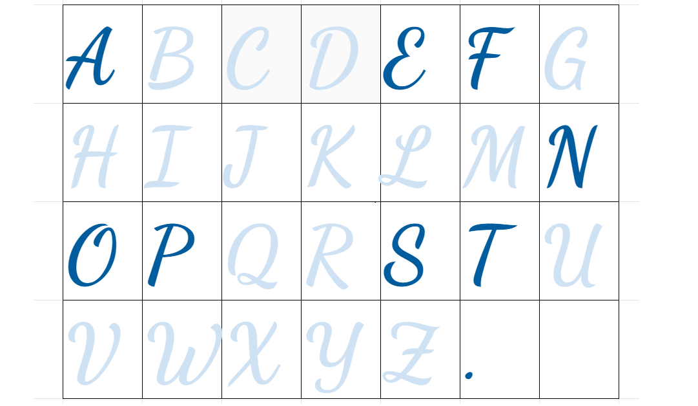
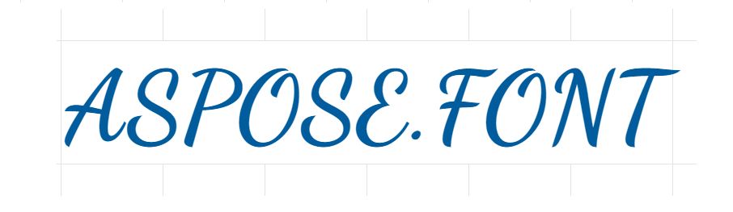
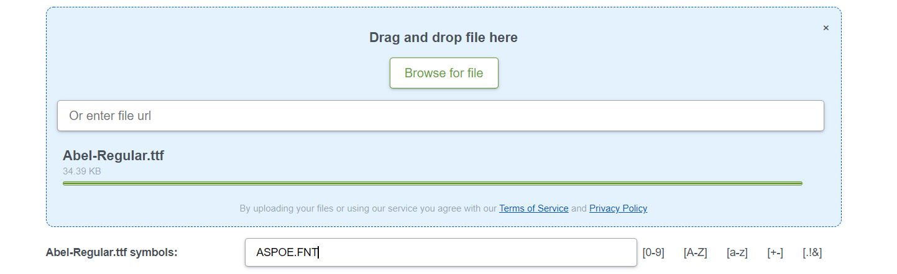
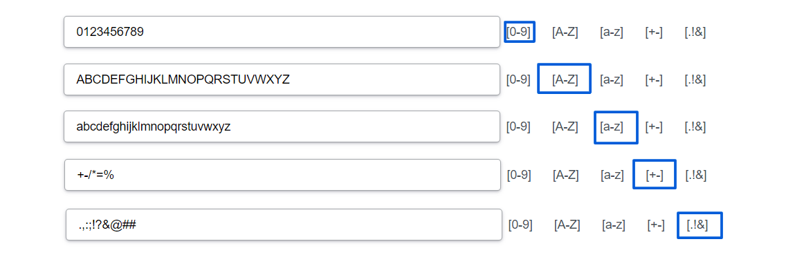
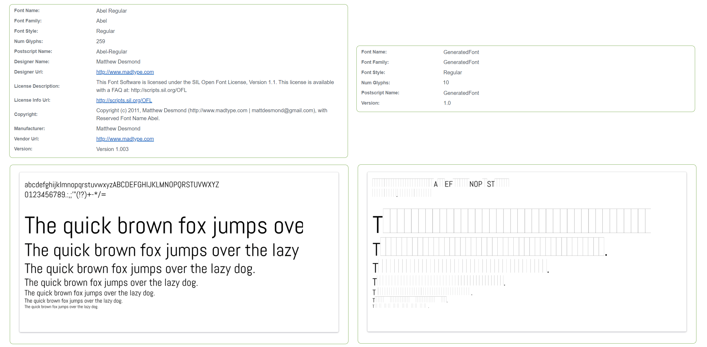

## What is Font subsetting ##

Font subsetting is a process of taking specific characters from a font file. These characters though may be represented by a few glyphs. We will explain this moment further.

As it was told in the article about [*glyphs*](https://docs.aspose.com/font/net/what-is-font/glyph/), font file includes as it called [*glyphsets*](https://docs.aspose.com/font/net/what-is-font/glyph/#glyphsets). Their size varies dramatically and can be more than 5000 glyphs large. With subsetting you can create a file from only a few of them.

## Why would you need to create a subset? ##

Let's describe situations when subsetting would give you some benefit.

- Big overloaded font files not only take much space but also are messy to manage. Why would you need to have the full set, when your project is only oriented toward an English-speaking audience. In this case, you would only need English letters and numbers.

- Another situation is when you have chosen a font that is going to be used only for your logo, or brand name, it would be reasonable to have a light small font subset that includes only the letters from the logo/brand name. Imagine we need only characters for writing logo Aspose.Font in Dancing Script in upper letters, then the subset would look like something like that. Only 9 characters were taken from the 500 kb.-size font.

So the logo made in the subset of Dancing Script subset would look like this.

- Regular glyphsets can also include letters of more than 200 languages  and many advanced elements like special grammatical symbols, small caps letters, different styles of the same letter or symbol. You will not use all of them, moreover not all of these glyphs can be rendered on the web. So why not get a smaller file without useless elements.

- The other aspect worth mentioning is that some of the fonts are not free and some of them may cost pretty much, especially designed ones. So buying only a font subset will let you save money when having a unique, beautiful text for your project. Of course in this case you do not create a subset by your own, but still.

## Subset Web Font ##

Web fonts consist of two important parts. They are characters (letters, numbers, punctuation) and Open Type features. 
The characters are placed in specific blocks relying on their functionality or language. Each of them has its own code(Unicode) mapped to a hex number.
The Open Type features refer more to glyphs (variations of these characters). 
 
Web font is one of the formats created especially for web projects, pages, sites, etc. It is aimed to make the text render properly in browsers and shorten page weight. You can learn more about [*WOFF*](https://docs.aspose.com/font/net/what-is-font/font-formats/#web-open-font-format) and [*WOFF2*](https://docs.aspose.com/font/net/what-is-font/font-formats/#web-open-font-format-2) fonts from the article that tells about [*font formats*](https://docs.aspose.com/font/net/what-is-font/font-formats/).

Some also mention such terms as HTML font when talking about web fonts. This term refers to having one or more fallback options in case your font is not able to be rendered in some browser. HTML web font uses a web font installed on the user's device as a fallback.

When talking about web fonts subsetting may have another advantages:
- Using font subsets lets save page weight, to improve user experience.
- As a developer you can get rid of characters of the unsupported languages.
- Because of the small size of the files you can use more different fonts in your web project, and add more fallback options.

## How to create a font subset with Aspose? ##

There are many ways to create a font subset. Some are programmatic ways, and some are just desktop or online applications.

### Font Generator cross-platform application ###

As an expert in managing fonts among the variety of different useful solutions Aspose.Font has also a cross-platform application that can help you to create a subset from your font.

The functionality is pretty simple. With it, you can combine glyphs of a few font files into a single one, or just make a much smaller, clearer file. You can pick out lower letters, numbers, punctuation, or type in the needed characters. It supports TTF, WOFF, EOT, CFF and Type 1 formats.

Let's imagine we want to have our logo made of letters from the Abel Regular font. Its file is not that big, just 35 kb. and contains only 259 glyphs but yet we still want to make it as small as possible.

After loading the font from the device or holder, it is possible to choose the needed characters. We need just 9 of them for our logo.

If needed there are a few buttons to make the process faster so you could choose upper or lower letters, numbers, mathematical symbols, or punctuation in one click.

In a moment you will be able to download the result. In our case, the generated font file is 2 kb.-large. So we've got the 15 times smaller file.
Let's compare the two documents using [*Viewer application*](https://products.aspose.app/font/viewer)

As you may notice, the number of glyphs of the generated file is 10 and not 9 as we needed for our logo. The answer to this inconsistency is in the aforementioned thesis that one character may be represented by a few glyphs. So apparently one of the letters or the dot symbol has another variation of its look.

So that is obvious that with a much bigger file, you can get much more notable results. It somehow seems as useful as compressing the content(text files, images) with archives, but in comparison to compression, the quality of the characters of the subset does not change a bit.

{}
The article here described one of the many applications for managing fonts. To see what else we can offer for such a purpose, go to [*Font Applications*](https://products.aspose.app/font/applications) where you can find online converters, viewers, mergers, different generators, and many more.
{}

