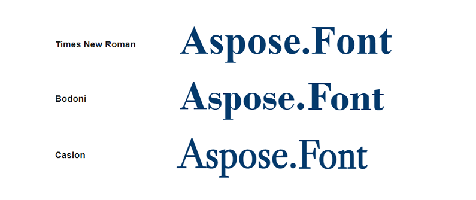

## Overview ##

As we learned from the article about [*Fonts*](https://docs.aspose.com/font/net/what-is-font/), they have a bunch of different parameters. One of them is font type. 
Font type is the way letters of the font are going to look like. 
The other way to describe font type is as a group of fonts with a specific set of features that influence how the font appears.

## Key font types ##
Because of the difference in the look of fonts of the type, they are usually used for different purposes or in different spheres. That is why working with fonts it might be necessary to know about their type. 

There are five key font types allocated:
- serif fonts;
- sans serifs;
- script fonts;
- display fonts;
- monospace fonts.

Let’s describe them in the table depending on their defining feature, main use, and well-known representatives.

| **Font style**| **Defining feature**| **Main use**| **Representatives**|
| :- | :- |:- | :- |
|Serif fonts|Letters have serifs|Typoghaphy|Times New Roman, Bodoni, Caslon, Trajan, Eames Century Modern|
|San serif fonts|Letters don’t have serifs|Screen type|Arial, Helvetica, Gotham, Akzidenz Grotesk, Futura|
|Script fonts|Resemble handwriting|Different|Shelley, Bickham, Lobster|
|Display fonts|Cannot be used for the main text|Titles, advertisement|Bella, Karloff, Neu Alphabet, Impact|
|Monospace fonts|Each symbol takes equal horizontal space|Coding|Courier, FF Trixie, Inconsolata|

### Serif fonts ###
Serif is a small dash at the beginning or the end of a stroke on a letter. 

It is known that they originate from letters of the ancient Roman period. They are well spread for typewriting in books, magazines, newspapers because they are easy to read on paper. Times New Roman, as one of the most famous of the representatives, is the font used for writing term papers, graduate works, essays in many educational institutions. 

Serif fonts are classified next way:
- **Old-Style** serifs. They look like they are written in ink.
- **Transitional serifs**. They are with a visible contrast between thick and thin strokes.
- **Didone or neoclassical**. They distinguish themselves by heavy contrast between thick and thin strokes.
- **Slab serifs**. These fonts are the heaviest and boldest fonts of the type.

Examples of serif fonts are shown in the picture below.

### Sans serif fonts ###

The fonts of this type do not have serifs. They are simpler to read or distinguish on screens, therefore, they are becoming more and more popular and well spread. Many famous brands tend to use them for their logos because of their simplicity and laconic design.
Arial, as one of the representatives, is the default font in Google Docs.

Sans serif fonts can be divided into text groups:
- **Grotesque**. They have contrast between thick and thin strokes, and vertical or no visible stress.
- **Humanist**. These fonts distinguish themselves by medium contrast between thick and thin strokes, and by slanted stress.
- **Geometric**. Fonts of this group have low contrast between thick and thin strokes, circular round forms, and vertical stress.

The most used sans serif fonts are depicted below.

### Script Fonts ###

These fonts imitate handwriting. As a result, there are a lot of different script styles. In some, - letters are conjoined together as if handwritten, in some styles letters are separate. 
Most script fonts are commonly used for book covers and projects where a unique and authentic look is required. 
Because of their elegance, they are often used for wedding printed production like wedding invitations, etc.

### Display fonts ###

These fonts are developed for titles, signboards, advertisements, etc. They are usually very bold and large-sized with an unusual design, that is because their main purpose is to attract attention to the written text. 

A few of the representatives of display fonts are shown in the next picture.

### Monospace fonts ###

Most fonts are proportional and give different horizontal spaces for different letters. Letter "W", for example, is the widest and "l" the thinnest. Monospace fonts on the contrary give each letter an equal space. That is because the first these fonts were developed for typewriters. Then with the first computer, they got a new life. Even though computers progressed dramatically and there is not that memory scarce nowadays, monospace fonts are widely used in code programming. Some designers use these fonts to give the text nostalgic, retro vibes.

## Conclusion ##

There are five key font types known. They have different appearances and different aims. But it is only up to you which font you see as a proper one for your design. If a font is usually used for coding it does not mean that you cannot use it in other projects, on the contrary, it may give your design a fresh, unique style.

{}
Before choosing a font for your work, you need to learn all its parameters and to do it you can use a free online application from Aspose, [*Font viewer*](https://products.aspose.app/font/viewer). The app will give you such information as font source, designer, license, font family, style, postscript name, number of glyphs, and many more.
{}

